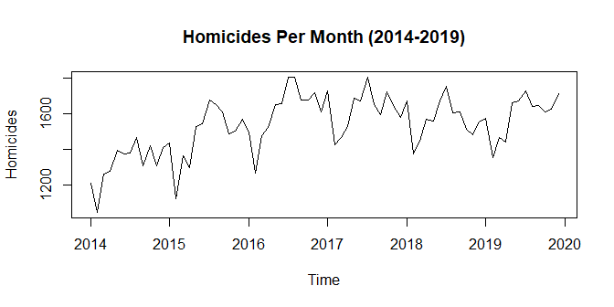
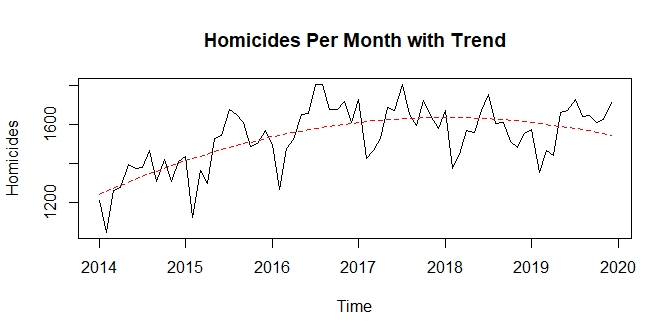
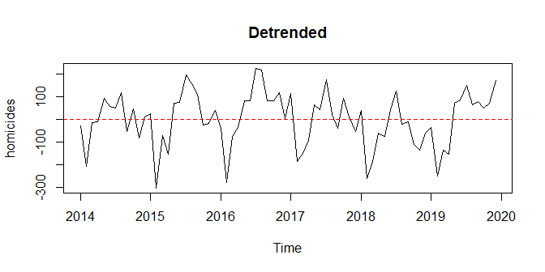
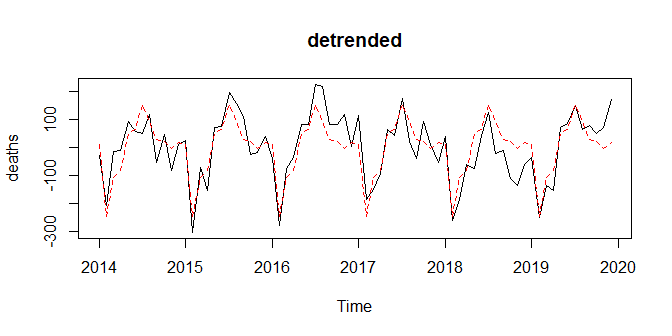
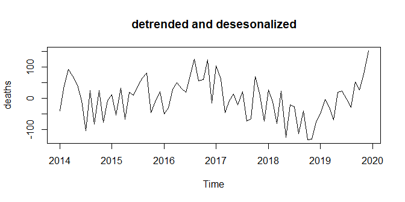
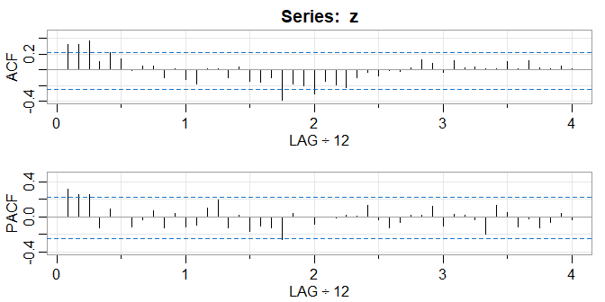
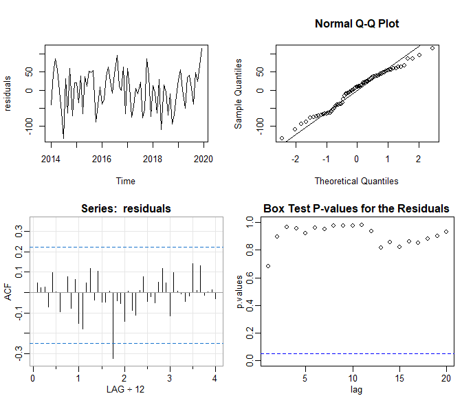
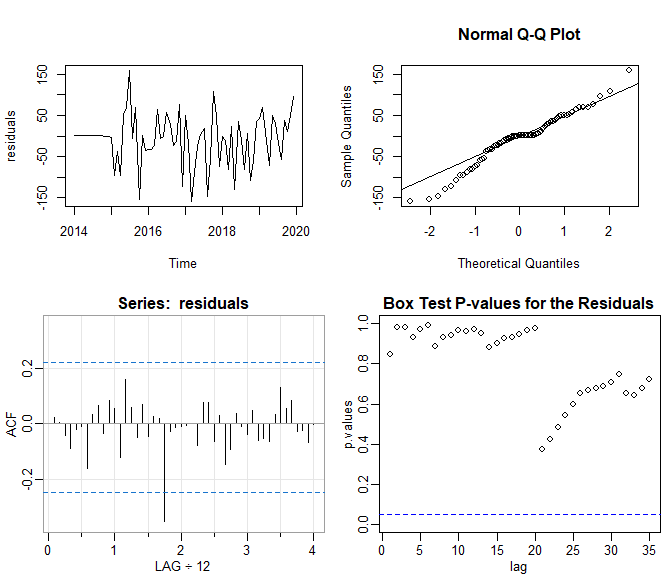
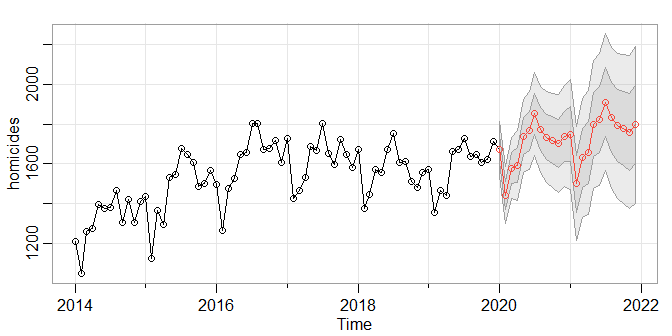

Time Series Analysis of Homicides in the US
================
Alex Cluff
4/20/2021

# Introduction

  The original dataset is called “Monthly Counts of Deaths by Select
Causes, 2014-2019” from catalog.data.gov
[\[link\]](https://catalog.data.gov/dataset/monthly-counts-of-deaths-by-select-causes-2014-2019).
The counts are exclusivly from the US. The analysis will be done on a
subset of this data. Specifically death counts by homicide.

<!-- -->

The data ranges from 2014 through 2019. Homicides are increasing over
time with a parabolic trend. Seasonality appears to be yearly with large
dips around January.

# Trends, Seasonality, and ARMA Analysis

## Estimating the Trend

  I fit the trend using regression modeling and a second order
polynomial such that
*x*<sub>*t*</sub> = *β*<sub>0</sub> + *β*<sub>1</sub>*t* + *β*<sub>2</sub>*t*<sup>2</sup> + *y*<sub>*t*</sub>
where *μ*<sub>*Y*</sub> = 0 and *x*<sub>*t*</sub> is the original time
series. $\hat{\beta_0}=-1.000632* 10^{8}$,
$\hat{\beta_1}=9.9172141* 10^{4}$, and
$\hat{\beta_2}=-24.572$.

<!-- --><!-- -->

## Estimating the Seasonal Component

The seasonality is first estimated using monthly averages. Here they are
after being estimated using a main effects regression model for the
months such that
*y*<sub>*t*</sub> = *s*<sub>*t*</sub> + *z*<sub>*t*</sub> where
*y*<sub>*t*</sub> is the result of detrending the data and
$s_t=\hat{s_j}$ is the mean for month *j* = 1, ...12.

    ##    MJan    MFeb    MMar    MApr    MMay    MJun    MJul    MAug    MSep    MOct 
    ##   12.33 -247.49 -105.64  -84.27   51.10   64.65  152.54   93.43   28.00   22.58 
    ##    MNov    MDec 
    ##   -5.16   17.93

<!-- -->

## Fitting an ARMA model

The detrended, deseasonalized time series:
*z*<sub>*t*</sub> = *x*<sub>*t*</sub> − (*β*<sub>0</sub>+*β*<sub>1</sub>*t*+*β*<sub>2</sub>*t*<sup>2</sup>+*s*<sub>*t*</sub>)

<!-- --><!-- -->

From the ACF plot it is evident that the trend is not a great fit. I
would have fit a higher order polynomial, however, R can not fit
anything over a second order polynomial. The second order polynomial
also makes for a very bad prediction.

From the ACF graphs, I can see some correlation out to lag 3. After some
testing, an AR(3,0) does fit the best.

    ## 
    ## Call:
    ## arima(x = z, order = c(3, 0, 0))
    ## 
    ## Coefficients:
    ##          ar1     ar2     ar3  intercept
    ##       0.1691  0.2197  0.2866     6.3986
    ## s.e.  0.1173  0.1154  0.1192    18.8916
    ## 
    ## sigma^2 estimated as 2935:  log likelihood = -389.89,  aic = 789.78

The Model:
*x*<sub>*t*</sub> = *ϕ*<sub>1</sub>*x*<sub>*t* − 1</sub> + *ϕ*<sub>2</sub>*x*<sub>*t* − 2</sub> + *ϕ*<sub>3</sub>*x*<sub>*t* − 3</sub> + *w*<sub>*t*</sub>
where,
*ϕ*<sub>1</sub> = 0.169, *ϕ*<sub>2</sub> = 0.220, *ϕ*<sub>3</sub> = 0.287, and *w*<sub>*t*</sub>∼<sup>*i**i**d*</sup>*N*(6.399,2935)

<!-- -->

From these diagnostic plots we can see the the model is an acceptable
fit besides the correlation around lag 2 in the residuals.

95% confidence interval:

    ##               ar1         ar2        ar3 intercept
    ## lower -0.06092554 -0.00652908 0.05292215 -30.62897
    ## upper  0.39905895  0.44593797 0.52029038  43.42608

  The standard deviations are slightly too large and the first two
coefficients are not significant because the CIs contain 0. When fitting
a model like this it would be a bad idea to remove the coefficients
entirely when there is a significant *ϕ*<sub>3</sub>.

Therefore, the final model is:
$$
z_t=x_t-(-1.000632\times 10^{8}+9.9172141\times 10^{4}t+-24.572t^2+\hat{s_t})
$$
*x*<sub>*t*</sub> = 0.169*x*<sub>*t* − 1</sub> + 0.22*x*<sub>*t* − 2</sub> + 0.287*x*<sub>*t* − 3</sub> + *w*<sub>*t*</sub>,  *w*<sub>*t*</sub> ∼ *N*(6.399,2935.034)
Where *t* is month *j* = 1, .., 12, $\hat{s_t}$ is:

    ##    MJan    MFeb    MMar    MApr    MMay    MJun    MJul    MAug    MSep    MOct 
    ##   12.33 -247.49 -105.64  -84.27   51.10   64.65  152.54   93.43   28.00   22.58 
    ##    MNov    MDec 
    ##   -5.16   17.93

# SARIMA Modeling

## Fitting the Model

  For the SARIMA model, the best fit was achieved with a
SARIMA(2,1,0)(0,1,1)\[12\] model of the form SARIMA(p,d,q)(P,D,Q)\[S\].
Originally I fit a third order AR component similar to my previous ARMA
model. The model did not fit well. This model has the lowest AIC. The
data has seasonality as well as a trend so it needs to be differenced
twice. S = 12 and d/D = 1. A seasonal MA of order 1 also decreased the
AIC, so Q = 1.

ARIMA model:
(1−*ϕ*<sub>1</sub>*B*−*ϕ*<sub>2</sub>*B*<sup>2</sup>)(1−*B*)(1−*B*<sup>12</sup>)*x*<sub>*t*</sub> = (1+*θ*<sub>1</sub>*B*<sup>12</sup>)*w*<sub>*t*</sub>

such that:
(1+0.7173*B*+0.3790*B*<sup>2</sup>)(1−*B*)(1−*B*<sup>12</sup>)*x*<sub>*t*</sub> = (1+0.7089*B*<sup>12</sup>)*w*<sub>*t*</sub>,  *w*<sub>*t*</sub>∼<sup>*i**i**d*</sup>*N*(0,4702)

    ## $fit
    ## 
    ## Call:
    ## arima(x = xdata, order = c(p, d, q), seasonal = list(order = c(P, D, Q), period = S), 
    ##     include.mean = !no.constant, transform.pars = trans, fixed = fixed, optim.control = list(trace = trc, 
    ##         REPORT = 1, reltol = tol))
    ## 
    ## Coefficients:
    ##           ar1      ar2     sma1
    ##       -0.7173  -0.3790  -0.7089
    ## s.e.   0.1254   0.1257   0.2202
    ## 
    ## sigma^2 estimated as 4702:  log likelihood = -337.56,  aic = 683.11
    ## 
    ## $degrees_of_freedom
    ## [1] 56
    ## 
    ## $ttable
    ##      Estimate     SE t.value p.value
    ## ar1   -0.7173 0.1254 -5.7224  0.0000
    ## ar2   -0.3790 0.1257 -3.0161  0.0038
    ## sma1  -0.7089 0.2202 -3.2198  0.0021
    ## 
    ## $AIC
    ## [1] 11.57817
    ## 
    ## $AICc
    ## [1] 11.58556
    ## 
    ## $BIC
    ## [1] 11.71902

<!-- -->

This model fits quite well. The spike around lag 2 and the lower end of
the Q-Q plot stand out, but does not look like a huge problem.

## Prediction

This is a prediction for the next 24 months.

<!-- -->

    ## $pred
    ##           Jan      Feb      Mar      Apr      May      Jun      Jul      Aug
    ## 2020 1675.143 1442.789 1579.335 1593.680 1740.108 1767.190 1851.684 1774.708
    ## 2021 1749.584 1501.415 1630.197 1656.105 1797.181 1823.720 1910.632 1832.128
    ##           Sep      Oct      Nov      Dec
    ## 2020 1735.190 1719.117 1702.715 1739.025
    ## 2021 1792.789 1777.166 1760.374 1796.794
    ## 
    ## $se
    ##            Jan       Feb       Mar       Apr       May       Jun       Jul
    ## 2020  69.02733  71.71663  77.28532  87.39358  91.97342  97.65347 103.55024
    ## 2021 137.68428 142.96224 148.82629 155.45545 160.84283 166.37143 171.84420
    ##            Aug       Sep       Oct       Nov       Dec
    ## 2020 108.29495 113.22140 117.97422 122.38196 126.71827
    ## 2021 176.94913 181.99803 186.93383 191.68851 196.33374

# Comparing Models

  The largest difference between the two methods is using the
differencing when fitting the SARIMA model. This allowed for a much
better fit. Residuals for the ARMA model had correlation when they
should not have. This is due to the poor fit of the trend. On a similar
note, the parabolic trend used for in the first did not capture the
overall trend very well. The forecast continued the trend and went down.
In reality, the trend would go up as in the figure above. This would
have been slightly better if R allows fitting a higher order polynomial
as I mentioned before.

# Conclusion

  In general, differencing is much easier and effective at capturing
complicated trends. Seasonal AR and MA componets also add very important
correlation to a model. A more complicated ARIMA is not always needed,
but there are many benefits.

# Code

``` R
knitr::opts_chunk$set(echo = FALSE, fig.height=3.5, message=FALSE, warning=FALSE)
library(readr)
library(knitr)
library(astsa)
homicides <- ts(read_csv("deaths.csv"), start = 2014, frequency = 12)
plot(homicides, main = "Homicides Per Month (2014-2019)")
t <- time(homicides)
trend.coef <- lm(homicides ~ poly(t, 2, raw = TRUE))$coefficients
trend <- trend.coef[1] + trend.coef[2]*t + trend.coef[3]*t^2
plot(homicides, main = "Homicides Per Month with Trend")
lines(trend, col = "red", lty = 2)
detrended <- homicides - trend
plot(detrended, main = "Detrended")
abline(h = 0, col = "red", lty = 2)
M = factor(rep(month.abb, length.out = 72), levels = month.abb)
seasonal.means <- lm(detrended ~ M + 0)$coefficients
seasonality.ts <- ts(rep(seasonal.means, length.out = 72), start = 2014, frequency = 12)
round(seasonal.means, 2)
plot(detrended, ylab = "deaths", main = "detrended")
lines(seasonality.ts, col = "red", lty = 2)
z <- detrended - seasonality.ts
plot(z, ylab = "deaths", main = "detrended and desesonalized")
cf <- acf2(z)
model <- arima(z, order = c(3,0,0))
model
par(mfrow = c(2,2))
residuals <- model$residuals
plot(residuals)
qqnorm(residuals)
qqline(residuals)
acf <- acf1(residuals)
lag <- 1:20
lags <- as.list(lag)
p.values <- sapply(lags, function(x) Box.test(residuals, x, "Ljung-Box")$p.value)
plot(lag, p.values, ylim = c(0,1), main = "Box Test P-values for the Residuals")
abline(h=0.05, col = "blue", lty = 2)
lower = model$coef - 1.96 * sqrt(diag(model$var.coef))
upper = model$coef + 1.96 * sqrt(diag(model$var.coef))
rbind(lower,upper)
coef <- round(c(model$coef, model$sigma2),3)
round(seasonal.means, 2)
model.sarima <- sarima(homicides, 2, 1, 0, 0, 1, 1, 12, details = F)
model.sarima
residuals <- model.sarima$fit$residuals
par(mfrow = c(2,2))
plot(residuals)
qqnorm(residuals)
qqline(residuals)
acf <- acf1(residuals)
lag <- 1:35
lags <- as.list(lag)
p.values <- sapply(lags, function(x) Box.test(residuals, x, "Ljung-Box")$p.value)
plot(lag, p.values, ylim = c(0,1), main = "Box Test P-values for the Residuals")
abline(h=0.05, col = "blue", lty = 2)
sarima.for(homicides, 24, 2, 1, 0, 0, 1, 1, 12)
savehistory("C:/Users/AlexC/OneDrive/rws/5550/project/code.Rhistory")
```
